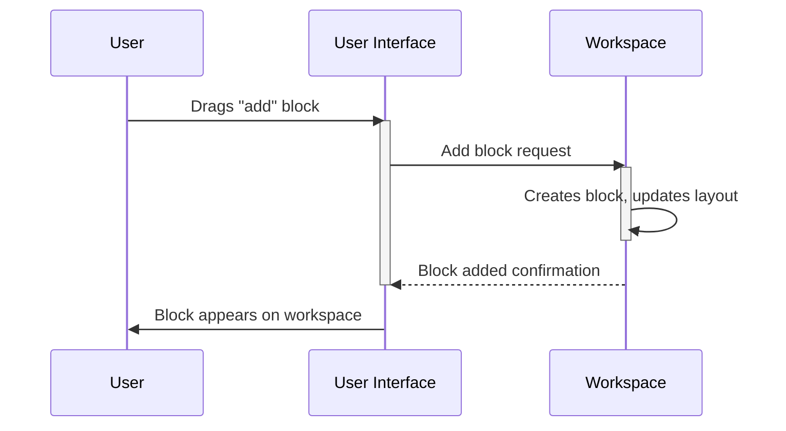

# Chapter 1: Blockly Workspace

Welcome to the world of Blockly!  This tutorial will guide you through building visual programs using Blockly.  We'll start with the fundamental building block (pun intended!) of any Blockly project: the workspace.

Imagine you're building with LEGOs. You need a surface to lay out your bricks and connect them, right? The Blockly workspace is exactly that – a digital surface where you arrange and connect your visual programming blocks.  It's where the magic happens!

Let's say we want to build a simple program that adds two numbers.  We'll use the workspace to arrange the blocks that perform this addition.

**What is a Blockly Workspace?**

The Blockly workspace is the main container for all your visual blocks. It's like a digital whiteboard where you can drag, drop, connect, and rearrange blocks to create your programs.  The workspace manages everything about the visual programming environment: where the blocks are, how they interact, and the overall state of your program.

**Using the Workspace (A Simple Example)**

While we won't dive into the code for creating a workspace just yet (that's for later chapters!), let's visualize how it works.  Imagine you have a toolbox (we'll cover [Blockly Toolbox](04_Blockly_Toolbox.md) later) with blocks representing mathematical operations like addition. You drag an "add" block onto the workspace. Then, you drag number blocks (like "5" and "3") and connect them to the "add" block's inputs. The workspace keeps track of all these blocks and their connections.  Finally, you can run the program (using a [Blockly Generator](03_Blockly_Generator.md), which we'll learn about later), and the workspace's arrangement of blocks determines the calculation performed (5 + 3 = 8).

**Under the Hood: A Simple Walkthrough**

Let's illustrate the basic interaction with a sequence diagram.  This shows what happens when you drag a block onto the workspace:

**A Glimpse at the Code (Simplified)**

The actual implementation of the Blockly workspace involves a lot of JavaScript code.  We won't go into the details now, but you can find the core code in Blockly's source files.  The `Workspace` object manages the blocks and their interactions.  For now, just remember that the workspace is the central container for your visual program.

**Conclusion**

In this chapter, we introduced the Blockly workspace, the foundation for building visual programs. We saw how it acts as a container for blocks and manages their interactions.  In the next chapter, we'll explore the individual building blocks themselves: [Blockly Blocks](02_Blockly_Block.md).

---

Generated by [AI Codebase Knowledge Builder](https://github.com/The-Pocket/Tutorial-Codebase-Knowledge)