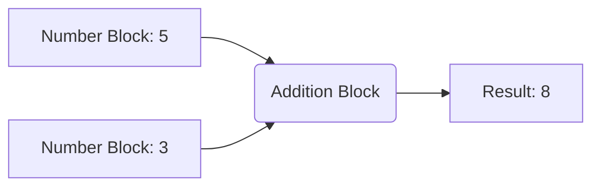
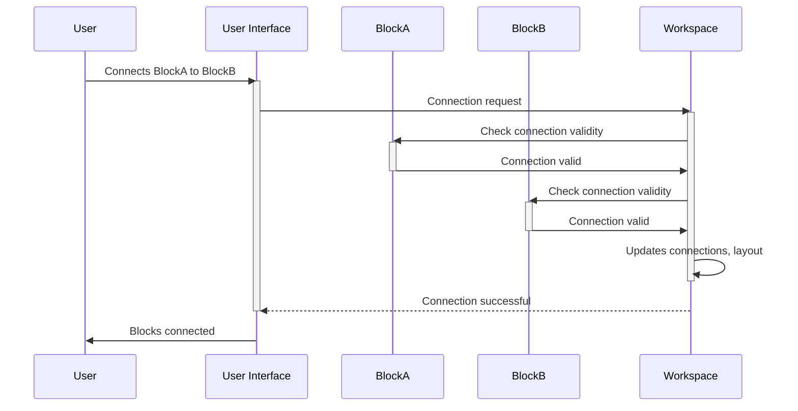

# Chapter 2: Blockly Block

In the previous chapter, [Chapter 1: Blockly Workspace](01_Blockly_Workspace.md), we learned about the workspace – the canvas where we build our programs.  Now, let's explore the stars of the show: the Blockly blocks themselves!

Imagine building with LEGOs again.  The workspace is your table, but the LEGO bricks are the Blockly blocks. Each brick has a specific shape and function; similarly, each Blockly block represents a specific piece of code.  We'll learn how to use these blocks to create programs.

Let's stick with our simple example from Chapter 1: adding two numbers.  We'll use Blockly blocks to achieve this.

**What is a Blockly Block?**

A Blockly block is a visual representation of a code concept.  It's a single unit in your visual program, like a function, a variable, or a mathematical operation.  Each block has:

* **Shape:**  The block's visual appearance (e.g., a rectangle, a hexagon).  The shape often hints at its function.
* **Inputs:** Places where you can connect other blocks to provide data or control flow.
* **Outputs:**  A connection point that sends data to other blocks.
* **Fields:**  Editable parts of a block, like text boxes for numbers or dropdown menus for options.

**Building a Simple Addition Program**

To add two numbers (say, 5 and 3), we'll need several blocks:

1. **Number Blocks:** These blocks represent numerical values (like "5" and "3").
2. **Math Block (Addition):** This block performs the addition operation.  It has two input slots to connect the number blocks.

Let's visualize this:



**How it Works (Simplified)**

When you connect the number blocks to the addition block's inputs and then run the program (using a [Blockly Generator](03_Blockly_Generator.md)), the Blockly system translates the arrangement of blocks into actual code (like `5 + 3`). The result is then displayed (in our case, "8").

**Under the Hood: A Simple Walkthrough**

Let's see what happens when you connect two blocks:



**A Glimpse at the Code (Simplified)**

Blockly blocks are defined using JavaScript.  Here's a highly simplified example:

```javascript
// This is a VERY simplified example and omits many details.
Blockly.Blocks['add'] = {
  init: function() {
    this.appendValueInput("A")
        .setCheck("Number"); // Accepts only number blocks
    this.appendValueInput("B")
        .setCheck("Number");
    this.setInputsInline(true); // Arrange inputs horizontally
    this.setOutput(true, "Number"); // Output is a number
    this.setPreviousStatement(true); // Can be connected to a previous block
    this.setNextStatement(true); // Can be followed by another block
    this.setColour(230); // Set block color
  }
};
```

This code snippet defines a block named "add" that takes two number inputs and outputs a number.  The actual implementation within Blockly is much more complex, handling various aspects like rendering, events, and code generation.  You can find more detailed examples in Blockly's source code.

**Conclusion**

In this chapter, we learned about Blockly blocks – the fundamental building blocks of Blockly programs. We saw how they represent code concepts and how they connect to form larger programs. In the next chapter, we'll explore the [Blockly Generator](03_Blockly_Generator.md), which translates these visual blocks into executable code.


---

Generated by [AI Codebase Knowledge Builder](https://github.com/The-Pocket/Tutorial-Codebase-Knowledge)