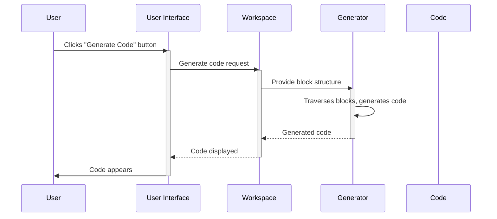

# Chapter 3: Blockly Generator

In the previous chapter, [Chapter 2: Blockly Block](02_Blockly_Block.md), we built a simple addition program using Blockly blocks.  But how does Blockly actually turn those visual blocks into something a computer can understand and run? That's where the Blockly Generator comes in!

Imagine you've built an amazing LEGO castle.  The generator is like a magical instruction manual that translates your LEGO creation into a set of instructions a robot could follow to build an identical castle.  Instead of LEGOs, we have Blockly blocks, and instead of a robot, we have a computer. The generator converts your visual program into code (like JavaScript or Python) that the computer can execute.

Let's revisit our addition program. We want to take the blocks we arranged in the [Blockly Workspace](01_Blockly_Workspace.md) and turn them into JavaScript code that adds two numbers.

**What is a Blockly Generator?**

A Blockly generator is a piece of code that takes the arrangement of blocks in your workspace and transforms it into text-based code in a specific programming language.  Each programming language (like JavaScript, Python, Lua, etc.) needs its own generator.  The generator traverses the blocks, understanding their connections and values, and produces the equivalent code.

**Generating JavaScript Code for Addition**

Let's say we have two number blocks ("5" and "3") connected to an "add" block in our workspace.  The JavaScript generator would translate this into:

```javascript
5 + 3;
```

This is a very simple example.  More complex programs with loops, conditionals, and functions will generate much more extensive code.

**How the Generator Works (Simplified)**

Let's visualize what happens when you generate code:



**A Glimpse at the Code (Simplified)**

The generator is defined by language-specific code within Blockly.  Here's a highly simplified example of how a JavaScript generator might handle our "add" block:

```javascript
Blockly.JavaScript['add'] = function(block) {
  // Get the values from the input blocks.
  var value_a = Blockly.JavaScript.valueToCode(block, 'A', Blockly.JavaScript.ORDER_ADDITION);
  var value_b = Blockly.JavaScript.valueToCode(block, 'B', Blockly.JavaScript.ORDER_ADDITION);
  // Generate the JavaScript code.
  var code = value_a + ' + ' + value_b + ';\n';
  return code;
};
```

This code snippet shows a function that handles the "add" block. It retrieves the values from the connected input blocks ('A' and 'B') and constructs the JavaScript code (`value_a + ' + ' + value_b + ';\n'`).  The `\n` adds a newline for better readability.  The actual Blockly generators are much more complex, handling various block types and code generation strategies. You can find them in Blockly's `generators` folder.

**Conclusion**

In this chapter, we learned about the Blockly Generator, the crucial component that translates your visual blocks into executable code. We saw how it works and looked at a simplified example of JavaScript code generation. In the next chapter, we'll explore the [Blockly Toolbox](04_Blockly_Toolbox.md), which provides the blocks you use to build your programs.


---

Generated by [AI Codebase Knowledge Builder](https://github.com/The-Pocket/Tutorial-Codebase-Knowledge)