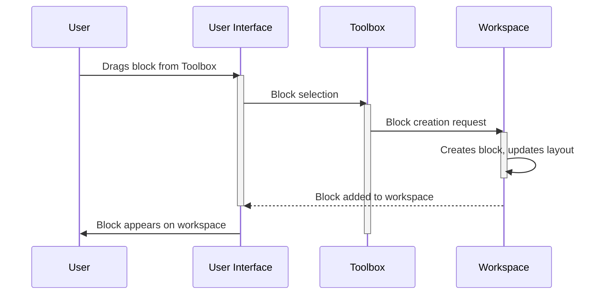

# Chapter 4: Blockly Toolbox

In the previous chapter, [Chapter 3: Blockly Generator](03_Blockly_Generator.md), we learned how Blockly converts visual blocks into code.  But where do those blocks come from?  That's where the Blockly Toolbox shines!

Imagine you're building with LEGOs again. You wouldn't just have LEGO bricks scattered everywhere, right? You'd have them organized in a toolbox, neatly categorized for easy access. The Blockly Toolbox is exactly that – a neatly organized palette of blocks that you can drag and drop onto the [Blockly Workspace](01_Blockly_Workspace.md) to build your programs.

Let's say we want to build a program that adds two numbers and then prints the result to the console.  We'll use the toolbox to get the blocks we need.

**What is a Blockly Toolbox?**

The Blockly Toolbox is a visual interface that displays all the available blocks in a categorized and organized manner.  It's like a menu or a palette where you select the blocks you need for your program.  Each category in the toolbox typically groups related blocks together (e.g., "Math," "Loops," "Variables").

**Building Our Program Using the Toolbox**

To build our addition and printing program, we'll need blocks from different categories within the toolbox:

1. **Math Blocks:**  We'll need number blocks (like "5" and "3") and an addition block ("add").
2. **Output Blocks:** We'll need a block to print the result to the console ("print").

We'll drag these blocks from the toolbox onto the workspace, connect them, and then use the [Blockly Generator](03_Blockly_Generator.md) to generate the code.

**How the Toolbox Works (Simplified)**

Let's visualize what happens when you drag a block from the toolbox:



**A Glimpse at the Code (Simplified)**

The toolbox is defined using XML.  Here's a highly simplified example:

```xml
<xml xmlns="https://developers.google.com/blockly/xml">
  <category name="Math">
    <block type="math_number"></block>
    <block type="math_arithmetic"></block>
  </category>
  <category name="Output">
    <block type="text_print"></block>
  </category>
</xml>
```

This XML snippet defines a toolbox with two categories: "Math" and "Output".  Each category contains blocks of specific types (`math_number`, `math_arithmetic`, `text_print`).  The actual toolbox XML can be much more complex, with many categories and blocks.  You'll typically find the toolbox XML in your Blockly project's configuration files.  Blockly then uses this XML to dynamically create the toolbox interface.

**Conclusion**

In this chapter, we learned about the Blockly Toolbox, the visual interface that provides access to the blocks used to build programs. We saw how it's defined using XML and how it interacts with the workspace. In the next chapter, we'll explore [Blockly Fields](05_Blockly_Field.md), the editable parts within the blocks themselves.


---

Generated by [AI Codebase Knowledge Builder](https://github.com/The-Pocket/Tutorial-Codebase-Knowledge)