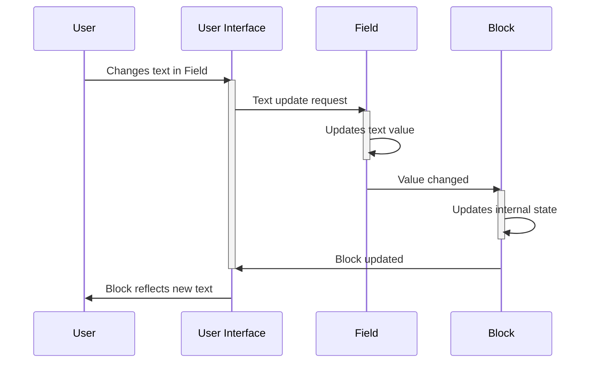

# Chapter 5: Blockly Field

In the previous chapter, [Chapter 4: Blockly Toolbox](04_Blockly_Toolbox.md), we learned how to use the toolbox to access and arrange blocks on the workspace.  Now, let's explore the interactive elements *within* those blocks: Blockly Fields!

Imagine you're building a robot with LEGOs. You might have a block that represents a motor, but you need to tell the motor how fast to spin.  That's where a field comes in – it lets you customize the block's behavior by providing input.  Blockly Fields are editable elements inside blocks, allowing users to input data directly into the block, changing how it functions.

Let's build a simple program that prints a message to the console.  We'll use a field to customize the message itself.

**What is a Blockly Field?**

A Blockly field is an interactive component *inside* a block.  It's like a small dial, a text box, or a dropdown menu that lets you change the block's settings.  Common types of fields include:

* **Text Input:** A simple text box where you can type in text.
* **Dropdown:** A menu where you select from a list of options.
* **Checkbox:** A box you can check or uncheck to toggle a setting.
* **Number Input:**  A field specifically for numerical input.

**Building a Message Printing Program**

We'll create a "print" block with a text input field.  This field will let the user type in the message they want to print.

**How it Works (Simplified)**

Let's see what happens when you change the text in a field:



**A Glimpse at the Code (Simplified)**

Creating a block with a field involves defining the field within the block's definition. Here's a simplified example:

```javascript
Blockly.Blocks['print_message'] = {
  init: function() {
    this.appendValueInput("MESSAGE")
        .setCheck(null); // Accepts any type
    this.setPreviousStatement(true);
    this.setNextStatement(true);
    this.setColour(160);
  }
};

Blockly.Blocks['print_message'].getField = function(name) {
    if (name === 'MESSAGE') {
        return new Blockly.FieldTextInput('Hello!'); // Default text
    }
    return null;
};
```

This code defines a "print_message" block. The `getField` function creates a `Blockly.FieldTextInput` field named "MESSAGE" with default text "Hello!".  The actual implementation is more complex, handling events and updating the block's appearance.  You can find more detailed examples in Blockly's source code.

**Conclusion**

In this chapter, we learned about Blockly Fields, the interactive elements within blocks that allow users to customize block behavior. We saw how to create a simple block with a text input field and explored a simplified example of its implementation. In the next chapter, we'll delve into [Blockly Inputs](06_Blockly_Input.md), which are the connection points on blocks that allow for more complex program structures.


---

Generated by [AI Codebase Knowledge Builder](https://github.com/The-Pocket/Tutorial-Codebase-Knowledge)