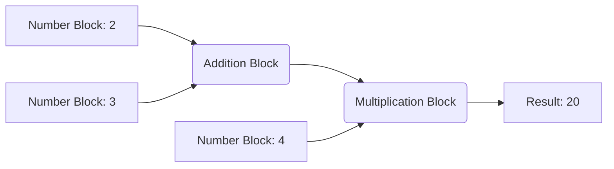
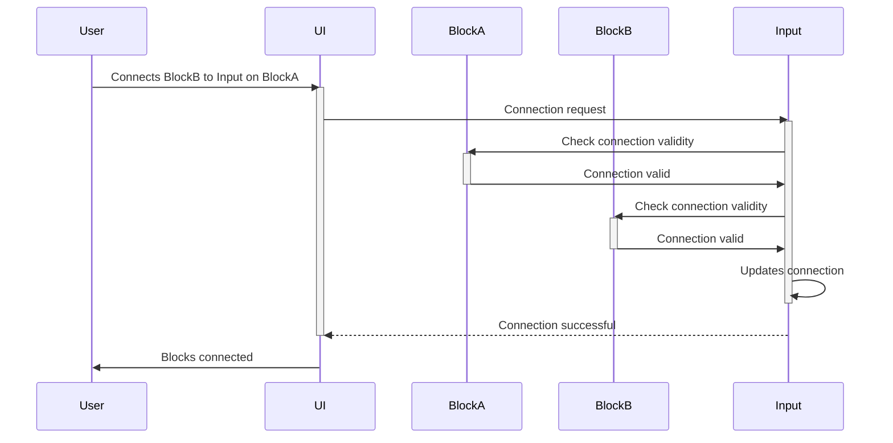

# Chapter 6: Blockly Input

In the previous chapter, [Chapter 5: Blockly Field](05_Blockly_Field.md), we learned how to add editable parts to our blocks. Now, let's explore how blocks connect to each other: Blockly Inputs!  Inputs are what allow us to build complex programs by linking blocks together.

Imagine LEGOs again.  A LEGO brick often has studs where you can attach other bricks.  Blockly Inputs are similar – they are connection points on a block where you can attach other blocks.  This lets you create chains of actions or more complex structures in your program.

Let's build a program that adds two numbers and then multiplies the result by a third number.  We'll use inputs to connect the blocks.

**What is a Blockly Input?**

A Blockly input is a connection point on a block.  It's where you attach other blocks to provide data or control the flow of your program.  There are different types of inputs, but we'll focus on the most common type: `appendValueInput`.

**Building Our Program Using Inputs**

To build our program, we'll need:

1. **Number Blocks:**  Blocks representing numbers (e.g., "2", "3", "4").
2. **An Addition Block:** A block that adds two numbers.  It will have two inputs.
3. **A Multiplication Block:** A block that multiplies two numbers. It will also have two inputs.

Let's visualize this:



We connect the number blocks to the addition block's inputs. The addition block's output then connects to one input of the multiplication block. Finally, another number block connects to the multiplication block's second input.

**How Inputs Work (Simplified)**

Let's see what happens when you connect a block to an input:



**A Glimpse at the Code (Simplified)**

Here's a simplified example of defining a block with two inputs:

```javascript
Blockly.Blocks['add'] = {
  init: function() {
    this.appendValueInput("A") // Input name "A"
        .setCheck("Number");
    this.appendValueInput("B") // Input name "B"
        .setCheck("Number");
    this.setInputsInline(true);
    this.setOutput(true, "Number");
    this.setColour(230);
  }
};
```

This code defines an "add" block with two value inputs named "A" and "B", both accepting only number blocks.  The `setCheck("Number")` part ensures that only blocks representing numbers can be connected. The `setOutput` line means this block can be connected to another block's input.

**Conclusion**

In this chapter, we learned about Blockly Inputs, the connection points that let us link blocks together to create complex programs. We saw how to define blocks with inputs and how these inputs enable the creation of more sophisticated program structures. In the next chapter, we'll explore [Chapter 7: Blockly Rendering](07_Blockly_Rendering.md), which deals with how Blockly visually displays your blocks and connections on the workspace.


---

Generated by [AI Codebase Knowledge Builder](https://github.com/The-Pocket/Tutorial-Codebase-Knowledge)