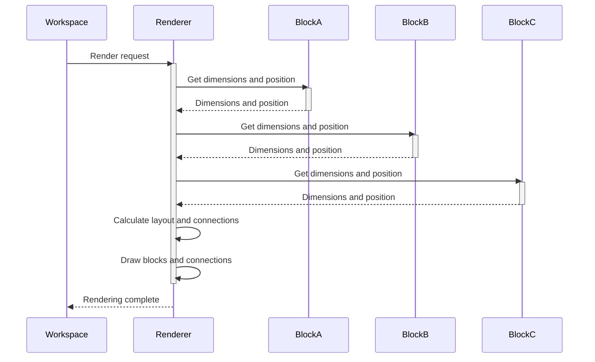

# Chapter 7: Blockly Rendering

In the previous chapter, [Chapter 6: Blockly Input](06_Blockly_Input.md), we learned how to connect blocks together to create more complex programs. Now, let's explore how Blockly visually represents these programs on the screen: Blockly Rendering!  Rendering is what makes your blocks look nice and helps you see how they're connected.

Imagine you've built a fantastic LEGO castle.  Rendering is like taking a picture of your creation so you can see the final result.  It takes the arrangement of your LEGO bricks (blocks) and transforms it into a visual representation on the screen.  Blockly's rendering system does the same for your visual programs.

Let's say we have a simple addition program with two number blocks connected to an "add" block.  The rendering system is responsible for drawing these blocks on the screen, positioning them correctly, and drawing the connections between them.

**What is Blockly Rendering?**

Blockly rendering is the process of drawing the blocks and their connections on the workspace.  It handles the visual aspects, making sure everything looks neat and organized.  It's responsible for:

* **Drawing the blocks:**  Each block has a specific shape and color, and the rendering system draws them accordingly.
* **Positioning the blocks:**  The rendering system makes sure blocks are placed correctly on the workspace, avoiding overlaps and maintaining a clear layout.
* **Drawing the connections:**  It draws the lines that connect blocks together, showing how data flows through your program.

**Rendering Our Addition Program**

Let's visualize how the rendering system works with our simple addition program:

This diagram shows a simplified version of the rendering process. The renderer asks each block for its dimensions and then calculates the best layout to avoid overlaps. Finally, it draws everything on the screen.

**A Glimpse at the Code (Simplified)**

The rendering process is quite complex and involves a lot of JavaScript code within Blockly.  We won't go into the details here, but you can find the core code in Blockly's source files related to rendering.  The rendering system is highly optimized to handle many blocks efficiently.

**Conclusion**

In this chapter, we learned about Blockly Rendering, the system that visually represents your blocks and connections on the workspace.  We saw how it handles drawing, positioning, and connecting blocks to create a visually appealing and understandable program representation.  In the next chapter, we'll explore [Chapter 8: Blockly Theme](08_Blockly_Theme.md), which lets you customize the look and feel of your Blockly workspace.

---

Generated by [AI Codebase Knowledge Builder](https://github.com/The-Pocket/Tutorial-Codebase-Knowledge)