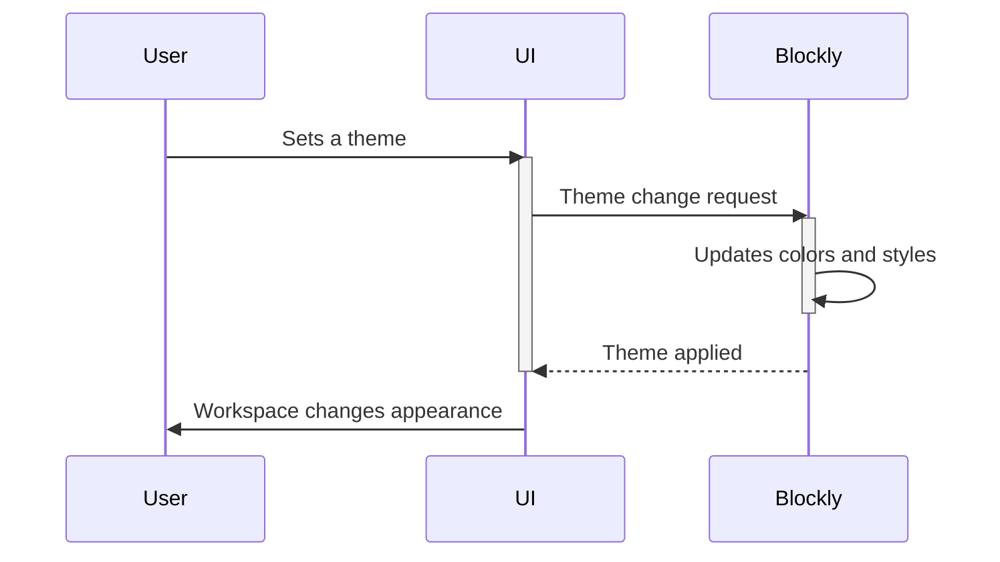

# Chapter 8: Blockly Theme

In the previous chapter, [Chapter 7: Blockly Rendering](07_Blockly_Rendering.md), we saw how Blockly draws blocks and connections on the workspace. Now, let's learn how to change the *look* of those blocks and the workspace itself using Blockly Themes!  Themes let you customize the colors, fonts, and overall style of your Blockly workspace, making it look exactly how you want.

Imagine you're building a LEGO castle, but you want it to be a pirate castle instead of a knight's castle. You'd change the colors of the bricks, maybe add some skull-and-crossbones pieces.  A Blockly theme does the same thing for your visual programs – it changes the visual style to match your preferences or branding.

Let's say we want our Blockly workspace to have a dark theme, perfect for late-night coding sessions. We'll use a theme to achieve this.

**What is a Blockly Theme?**

A Blockly theme defines the visual style of the workspace and blocks.  It's like a color palette and design scheme for your Blockly environment.  It controls things like:

* **Block colors:** The colors of different types of blocks.
* **Background color:** The color of the workspace itself.
* **Text color:** The color of text within the blocks and the workspace.
* **Font:** The type of font used for text.

**Creating a Dark Theme**

We'll create a simple dark theme with a dark gray background and bright text colors.  We'll do this by defining a JavaScript object that specifies the theme's properties.

```javascript
const darkTheme = {
  'base': '#333', // Dark gray background
  'blocklyText': '#fff', // White text
  'blocklyWs': '#444', // Slightly darker gray for workspace
  'blocklyTree': '#555', // Even darker gray for the toolbox
};
```

This code defines a `darkTheme` object. Each property sets a color for a different part of the Blockly workspace.  `'base'` is the overall background color. `'blocklyText'` is the color of text within blocks. `'blocklyWs'` is the workspace color, and `'blocklyTree'` is the toolbox color.  You can customize these colors to your liking.

**Applying the Theme**

To apply this theme, we'll use the `Blockly.Theme` object.  (We'll skip the detailed setup code for brevity, focusing on the theme itself).

```javascript
Blockly.defineTheme('darkTheme', darkTheme); // Define the theme
Blockly.setTheme('darkTheme'); // Apply the theme
```

This code first defines the theme using `Blockly.defineTheme` and then applies it to the workspace using `Blockly.setTheme`.  After this, your Blockly workspace will have the dark theme applied.

**How Themes Work (Simplified)**

Let's see what happens when you set a theme:



The UI sends a request to Blockly to change the theme. Blockly then updates the colors and styles of all elements in the workspace, and the UI reflects the changes.

**A Glimpse at the Code (Simplified)**

The `Blockly.Theme` object manages the theme's properties.  The actual implementation is quite complex, handling different CSS styles and updating the DOM.  You can find the core code in Blockly's source files related to rendering and themes.

**Conclusion**

In this chapter, we learned about Blockly Themes, which let you customize the visual appearance of your Blockly workspace. We created a simple dark theme and applied it to the workspace. In the next chapter, [Chapter 9: Blockly Events](09_Blockly_Events.md), we'll explore how to respond to user interactions within the Blockly workspace.


---

Generated by [AI Codebase Knowledge Builder](https://github.com/The-Pocket/Tutorial-Codebase-Knowledge)