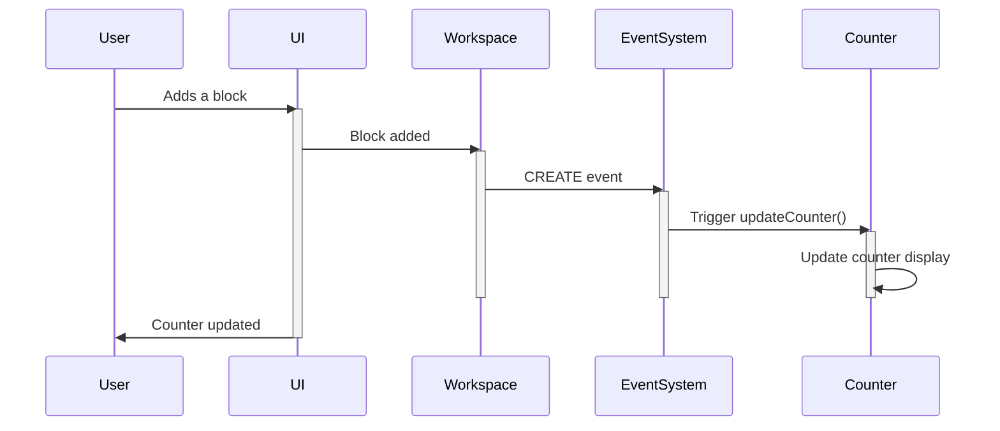

# Chapter 9: Blockly Events

In the previous chapter, [Chapter 8: Blockly Theme](08_Blockly_Theme.md), we learned how to customize the appearance of our Blockly workspace. Now, let's explore how to respond to actions within the workspace: Blockly Events!  Events are like little messages that Blockly sends out whenever something interesting happens, such as adding, moving, or deleting a block.  This lets us build interactive features and track changes in our programs.

Let's say we want to build a simple counter that displays the number of blocks currently in the workspace.  Every time a block is added or removed, the counter should update.  Blockly events will help us achieve this.

**What are Blockly Events?**

Blockly events are messages that Blockly generates whenever a change occurs in the workspace.  Think of them as notifications.  Each event describes the type of change and any relevant details.  Common event types include:

* `blockly.Events.CREATE`: A block is added to the workspace.
* `blockly.Events.DELETE`: A block is removed from the workspace.
* `blockly.Events.MOVE`: A block is moved.
* `blockly.Events.CHANGE`: A block's properties (like its value) are changed.

**Building Our Block Counter**

To build our counter, we'll listen for `CREATE` and `DELETE` events.  When a `CREATE` event occurs, we'll increment the counter.  When a `DELETE` event occurs, we'll decrement it.

**How to Listen for Events (Simplified)**

We'll use the `workspace.addChangeListener` function to register a listener for events.  This function takes a callback function as an argument.  The callback function will be executed whenever an event occurs.

```javascript
// Get the workspace
const workspace = Blockly.getMainWorkspace();

// Function to update the counter
function updateCounter() {
  const blockCount = workspace.getAllBlocks().length;
  document.getElementById('counter').textContent = blockCount;
}

// Add a change listener
workspace.addChangeListener(updateCounter);
```

This code first gets the main workspace. Then, it defines a function `updateCounter` that gets the number of blocks and updates the counter element on the page. Finally, it adds a change listener to the workspace, which calls `updateCounter` whenever any change happens.

**Explanation:**

This code snippet is very simple.  It gets the workspace, defines a function to update a counter element on the page based on the number of blocks, and then registers that function as a listener for workspace changes.  Every time a block is added or removed, the `updateCounter` function will be automatically called, updating the counter.

**Under the Hood: A Simple Walkthrough**

Let's see what happens when a block is added:



The user adds a block. The workspace detects this and sends a `CREATE` event to the event system. The event system then calls the registered listener (`updateCounter`), which updates the counter display.

**A Glimpse at the Code (Simplified)**

The `addChangeListener` function is part of the Blockly workspace's API.  The actual implementation involves managing a list of listeners and triggering them when events occur. You can find the relevant code in Blockly's workspace source files.

**Conclusion**

In this chapter, we learned about Blockly Events, which allow us to respond to changes in the workspace. We built a simple block counter using event listeners.  In the next chapter, [Chapter 10: Blockly.Msg (Message System)](10_Blockly.Msg_Message_System.md), we'll explore how to internationalize our Blockly applications.


---

Generated by [AI Codebase Knowledge Builder](https://github.com/The-Pocket/Tutorial-Codebase-Knowledge)