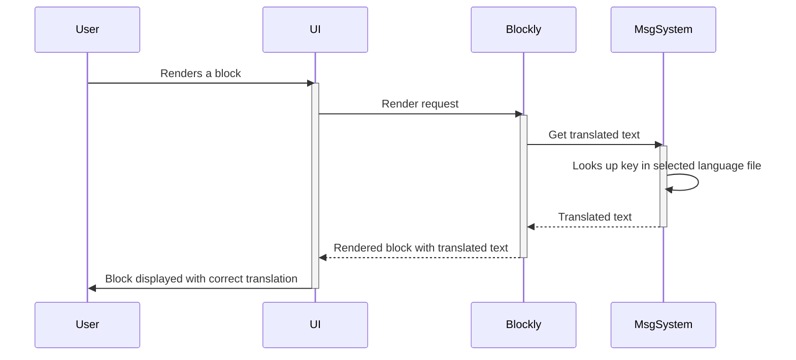

# Chapter 10: Blockly.Msg (Message System)

In the previous chapter, [Chapter 9: Blockly Events](09_Blockly_Events.md), we learned how to respond to user interactions in Blockly. Now, let's learn how to make our Blockly projects speak different languages!  This is where the `Blockly.Msg` message system comes in.

Imagine you're building a LEGO robot, but you want to share your creation with friends around the world.  You'd need instructions in their languages, right?  `Blockly.Msg` is like a multilingual instruction manual for your Blockly programs. It lets you translate all the text in your Blockly project into different languages, making it accessible to a global audience.

Let's say we want to create a simple Blockly project that says "Hello, world!" in English and Spanish.  We'll use `Blockly.Msg` to achieve this.

**What is Blockly.Msg?**

`Blockly.Msg` is a JavaScript object that stores all the text strings used in your Blockly project.  Each string is assigned a key, and the value is the English translation.  To add other languages, you create separate JavaScript files, each containing translations for a specific language.  Blockly then uses the selected language file to display the appropriate text.

**Adding a Spanish Translation**

First, we'll create a JavaScript file (e.g., `messages/es.js`) containing the Spanish translations.  We'll only translate the "Hello, world!" message for simplicity.

```javascript
// messages/es.js
Blockly.Msg["HELLO_WORLD"] = "Hola, mundo!";
```

This code defines a Spanish translation for the key "HELLO_WORLD".

**Using Blockly.Msg in Your Project**

Now, let's use this translation in our Blockly project.  We'll create a simple block that displays the message.

```javascript
// Your Blockly block definition
Blockly.Blocks['hello_world'] = {
  init: function() {
    this.appendDummyInput()
        .appendField(Blockly.Msg["HELLO_WORLD"]); // Use the message key
    this.setPreviousStatement(true);
    this.setNextStatement(true);
    this.setColour(230);
  }
};
```

This code uses `Blockly.Msg["HELLO_WORLD"]` to display the translated message.  If the selected language is Spanish, it will show "Hola, mundo!"; otherwise, it will use the default English message ("Hello, world!").

**How Blockly.Msg Works (Simplified)**

Let's see what happens when Blockly renders a block using `Blockly.Msg`:



Blockly asks the message system for the translated text based on the key. The message system finds the translation in the selected language file and returns it to Blockly.

**A Glimpse at the Code (Simplified)**

The `Blockly.Msg` object is a simple JavaScript object.  The actual implementation involves loading the correct language file based on user settings and using the keys to retrieve the translations.  You can find the core code in Blockly's `core` files and the language files in the `msg` directory.

**Conclusion**

In this chapter, we learned how to use `Blockly.Msg` to internationalize our Blockly projects. We created a simple Spanish translation and used it in a Blockly block.  This allows us to create Blockly projects that are accessible to users worldwide.  There is no next chapter in this tutorial series.


---

Generated by [AI Codebase Knowledge Builder](https://github.com/The-Pocket/Tutorial-Codebase-Knowledge)