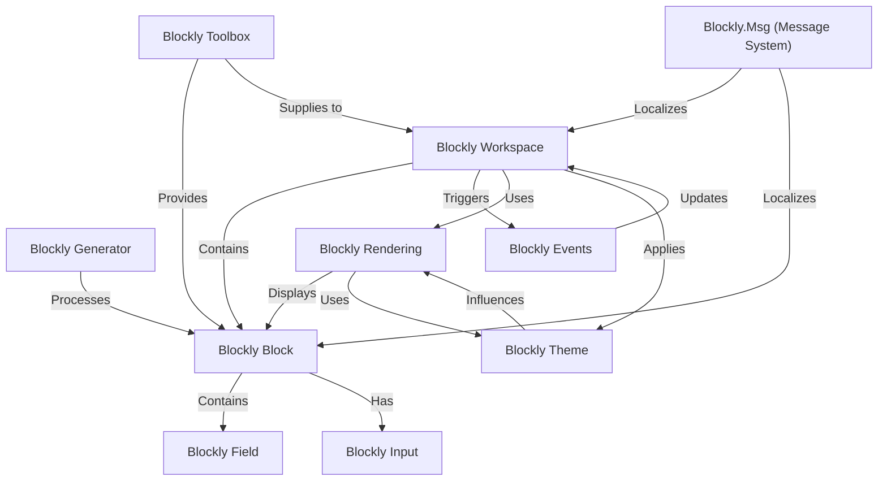

# Tutorial: blockly

Blockly is a visual programming editor that lets you build programs by dragging and dropping *graphical blocks*.  These blocks represent code concepts, and Blockly's **generator** translates them into real programming languages like JavaScript or Python.  It's like building with LEGOs, but for coding!

**Source Repository:** [https://github.com/google/blockly/tree/master](https://github.com/google/blockly/tree/master)

## Core Concepts Diagram

## Chapters

1. [Blockly Workspace](01_Blockly_Workspace.md)
2. [Blockly Block](02_Blockly_Block.md)
3. [Blockly Generator](03_Blockly_Generator.md)
4. [Blockly Toolbox](04_Blockly_Toolbox.md)
5. [Blockly Field](05_Blockly_Field.md)
6. [Blockly Input](06_Blockly_Input.md)
7. [Blockly Rendering](07_Blockly_Rendering.md)
8. [Blockly Theme](08_Blockly_Theme.md)
9. [Blockly Events](09_Blockly_Events.md)
10. [Blockly.Msg (Message System)](10_Blockly.Msg_Message_System.md)

---

Generated by [AI Codebase Knowledge Builder](https://github.com/The-Pocket/Tutorial-Codebase-Knowledge)