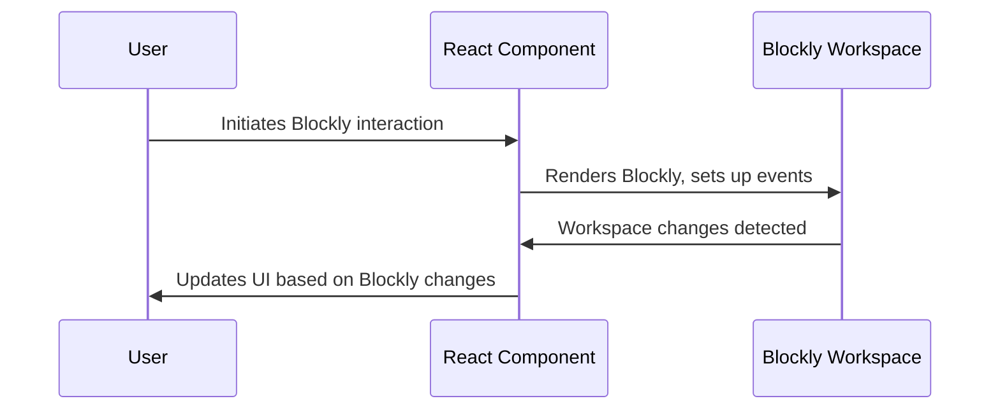

# Chapter 1: React Component Structure

Welcome to the world of `react-blockly`!  This tutorial series will guide you through building visual programming interfaces using React and Blockly.  This first chapter focuses on the foundation: understanding how React components are structured, which is crucial for integrating Blockly effectively.

Let's imagine you're building a simple app where users can create programs using Blockly blocks.  These programs will be displayed and manipulated within your React application.  To achieve this, we'll use React components to organize and manage the Blockly workspace.

## What are React Components?

React components are reusable building blocks for creating user interfaces.  Think of them like LEGO bricks: each brick has a specific function, and you can combine them to build complex structures.  In React, these "bricks" are components that manage their own data and render their own parts of the UI.

There are two main types of React components: functional components and class components.  `react-blockly` primarily uses functional components because they are simpler and easier to work with, especially when using hooks (which we'll cover later).

A simple functional component looks like this:

```jsx
function MyComponent() {
  return (
    <div>
      <h1>Hello, world!</h1>
    </div>
  );
}
```

This component simply returns a `div` element containing a heading.  When this component is rendered, React will create the corresponding HTML elements in the browser.

## Functional Components and Props

Functional components can receive data through *props*.  Props are like arguments passed to a function.  They allow you to customize the component's behavior and appearance.

Here's an example of a component that accepts a name as a prop:

```jsx
function Greeting(props) {
  return (
    <div>
      <h1>Hello, {props.name}!</h1>
    </div>
  );
}
```

If you use this component like `<Greeting name="Alice" />`, it will render "Hello, Alice!".

##  The Role of Components in `react-blockly`

In `react-blockly`, components are essential for managing the Blockly workspace and its interaction with the rest of your application. The core component, `BlocklyWorkspace`, handles the rendering and management of the Blockly editor itself.  We'll explore this component in detail in the next chapter, [BlocklyWorkspace Component](02_BlocklyWorkspace_Component.md).  For now, understand that this component will be the central piece of our Blockly integration, and its structure and behavior are based on the fundamental principles of React components we've just discussed.

## Internal Implementation (Simplified)

Let's look at a simplified representation of how a React component might interact with Blockly:



This diagram shows a basic interaction flow. The user interacts with the Blockly workspace, triggering events that are handled by the React component, which then updates the UI accordingly.

This chapter provided a foundational understanding of React component structure.  In the next chapter, [BlocklyWorkspace Component](02_BlocklyWorkspace_Component.md), we'll dive into the specific component used to integrate Blockly into your React application.


---

Generated by [AI Codebase Knowledge Builder](https://github.com/The-Pocket/Tutorial-Codebase-Knowledge)