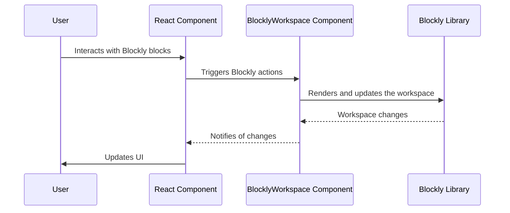

# Chapter 2: BlocklyWorkspace Component

In the previous chapter, [React Component Structure](01_React_Component_Structure.md), we learned about the building blocks of React applications. Now, let's put that knowledge to use by integrating Blockly, a visual programming editor, into our React project.  This chapter introduces the `BlocklyWorkspace` component, the heart of `react-blockly`, which makes this integration seamless.

Imagine you're building a simple app where users can drag and drop blocks to create programs.  The `BlocklyWorkspace` component is the container that holds these blocks and allows users to interact with them. It acts as a bridge between your React app and the Blockly library, handling all the complex communication behind the scenes.

## The `BlocklyWorkspace` Component: Your Blockly Container

The `BlocklyWorkspace` component is a React component that renders a Blockly workspace directly within your application.  Think of it as a special `div` element that's magically transformed into a fully functional Blockly editor.  It handles all the low-level details of setting up and managing the Blockly workspace, so you can focus on the user interface and application logic.

Let's see a minimal example:

```jsx
import { BlocklyWorkspace } from 'react-blockly';

function MyBlocklyApp() {
  return (
    <BlocklyWorkspace toolboxConfiguration={{}} />
  );
}
```

This code snippet imports the `BlocklyWorkspace` component and renders it.  The `toolboxConfiguration` prop (which we'll explore in detail in [toolboxConfiguration](04_toolboxConfiguration.md)) is currently empty, meaning no blocks are available in the workspace.  Even with an empty toolbox, this will render a blank Blockly workspace where you can later add blocks.

This simple example shows how easy it is to add a Blockly workspace to your React app using the `BlocklyWorkspace` component.  The component handles the complexities of integrating Blockly, allowing you to focus on building your application's functionality.

## Internal Implementation (Simplified)

Let's visualize how the `BlocklyWorkspace` component works:



The user interacts with the Blockly blocks.  The React component communicates these actions to the `BlocklyWorkspace` component, which then interacts with the Blockly library to update the workspace.  Any changes in the Blockly workspace are then relayed back to the React component, allowing for dynamic updates in your application.

The `BlocklyWorkspace` component manages the lifecycle of the Blockly workspace, including its creation, updates, and disposal.  It handles events from the Blockly library and translates them into React events, making it easy to integrate Blockly into your React application.  The actual implementation involves using the Blockly library's `Blockly.inject` function to create the workspace within a designated DOM element.  This is handled internally by the component, abstracting away the complexities of the Blockly library from your code.

## Conclusion

The `BlocklyWorkspace` component simplifies the process of integrating Blockly into your React application. It provides a convenient and efficient way to manage the Blockly workspace, handling the complexities of communication between React and the Blockly library.  In the next chapter, [useBlocklyWorkspace Hook](03_useBlocklyWorkspace_Hook.md), we'll explore a more flexible approach to integrating Blockly using a React hook.


---

Generated by [AI Codebase Knowledge Builder](https://github.com/The-Pocket/Tutorial-Codebase-Knowledge)