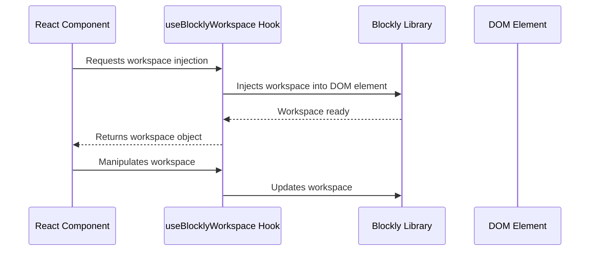

# Chapter 3: useBlocklyWorkspace Hook

In the previous chapter, [BlocklyWorkspace Component](02_BlocklyWorkspace_Component.md), we learned how to embed a Blockly workspace using the `BlocklyWorkspace` component.  This is great for simple integrations, but what if you need more control over how Blockly interacts with your React app?  That's where the `useBlocklyWorkspace` hook comes in!

Let's say you're building a more complex application where you need to dynamically update the Blockly workspace based on user actions outside of the Blockly area itself.  For example, you might have a button that adds a new block to the workspace, or a dropdown that changes the available blocks.  The `BlocklyWorkspace` component alone doesn't provide a straightforward way to handle this.  This is where the power of the `useBlocklyWorkspace` hook shines.

## The `useBlocklyWorkspace` Hook:  Direct Control Over Blockly

The `useBlocklyWorkspace` hook provides a more flexible and powerful way to integrate Blockly into your React application.  Instead of relying on props to manage the workspace, you directly interact with the Blockly workspace object within your component's logic.  Think of it as getting the "keys to the kingdom" – you have complete control!

To use this hook, you'll first need a `ref` to a DOM element where Blockly will be injected.  This ref will tell the hook where to place the Blockly workspace.

Here's a minimal example:

```jsx
import { useBlocklyWorkspace } from 'react-blockly';
import { useRef } from 'react';

function MyBlocklyApp() {
  const blocklyRef = useRef(null);
  const { workspace } = useBlocklyWorkspace({ ref: blocklyRef, toolboxConfiguration: {} }); //toolboxConfiguration explained in [toolboxConfiguration](04_toolboxConfiguration.md)

  return (
    <div>
      <div ref={blocklyRef} /> {/* Blockly workspace will be injected here */}
      <button onClick={() => {
          // Add a new block to the workspace (we'll learn how to do this later)
          if (workspace) {
            // Add your block adding logic here
          }
      }}>Add Block</button>
    </div>
  );
}
```

This code creates a `div` element and uses a `ref` to track it. The `useBlocklyWorkspace` hook uses this ref to inject the Blockly workspace into that `div`. The button demonstrates how you can directly interact with the `workspace` object obtained from the hook.

This example shows how easy it is to inject a Blockly workspace using the hook.  The `workspace` object gives you access to all the Blockly API functions, allowing you to manipulate the workspace programmatically.

## Internal Implementation (Simplified)

Let's visualize how the `useBlocklyWorkspace` hook works:



The React component calls the hook, providing the necessary configuration. The hook then uses the Blockly library to inject the workspace into the specified DOM element.  The hook returns the workspace object, allowing the component to directly interact with it.  Any changes made to the workspace through the hook are reflected in the Blockly editor.

The actual implementation involves using `Blockly.inject` to create the workspace and managing its lifecycle within the React component.  This is all handled internally by the hook, providing a clean and easy-to-use interface.

## Conclusion

The `useBlocklyWorkspace` hook offers a more flexible and powerful way to integrate Blockly into your React application compared to the `BlocklyWorkspace` component.  It allows for direct manipulation of the Blockly workspace, enabling dynamic updates and complex interactions.  In the next chapter, [toolboxConfiguration](04_toolboxConfiguration.md), we'll delve into configuring the types of blocks available in your Blockly workspace.


---

Generated by [AI Codebase Knowledge Builder](https://github.com/The-Pocket/Tutorial-Codebase-Knowledge)