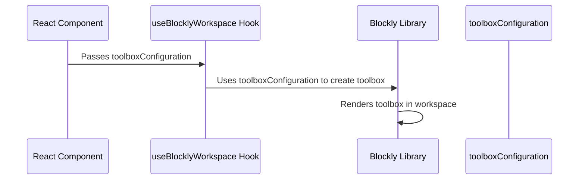

# Chapter 4: toolboxConfiguration

In the previous chapter, [useBlocklyWorkspace Hook](03_useBlocklyWorkspace_Hook.md), we learned how to use the `useBlocklyWorkspace` hook to gain direct control over our Blockly workspace.  But so far, our workspace has been empty!  This chapter introduces `toolboxConfiguration`, which lets us define the building blocks available to our users.

Imagine you're building a simple calculator app.  Users should be able to drag and drop blocks representing numbers and operations (+, -, *, /) to create calculations.  `toolboxConfiguration` is how we tell Blockly which of these blocks to make available.

## Defining Available Blocks with `toolboxConfiguration`

`toolboxConfiguration` is a JSON object that describes the categories and blocks available in the Blockly workspace.  It's like a menu in a restaurant; it shows the user what ingredients (blocks) they can use to build their program.

Let's start with a very simple `toolboxConfiguration` that provides only a single "math" category with a single block that adds two numbers:

```json
{
  "kind": "categoryToolbox",
  "contents": [
    {
      "kind": "block",
      "type": "math_number"
    }
  ]
}
```

This JSON defines a toolbox with one category. The `kind` property specifies the type of element, and `contents` lists the blocks within the category.  Here, we're using Blockly's built-in `math_number` block.

This `toolboxConfiguration` is then passed as a prop to `useBlocklyWorkspace`:

```jsx
import { useBlocklyWorkspace } from 'react-blockly';
import { useRef } from 'react';

function MyBlocklyApp() {
  const blocklyRef = useRef(null);
  const toolbox = {
    "kind": "categoryToolbox",
    "contents": [
      {
        "kind": "block",
        "type": "math_number"
      }
    ]
  };
  const { workspace } = useBlocklyWorkspace({ ref: blocklyRef, toolboxConfiguration: toolbox });

  return (
    <div>
      <div ref={blocklyRef} />
    </div>
  );
}
```

This will render a Blockly workspace with a single category containing the "math_number" block.  Users can drag this block into the workspace.

## Adding More Blocks and Categories

Let's expand our calculator example. We'll add more blocks and categories:

```json
{
  "kind": "categoryToolbox",
  "contents": [
    {
      "kind": "category",
      "name": "Numbers",
      "contents": [
        { "kind": "block", "type": "math_number" }
      ]
    },
    {
      "kind": "category",
      "name": "Operators",
      "contents": [
        { "kind": "block", "type": "math_arithmetic" }
      ]
    }
  ]
}
```

This configuration creates two categories: "Numbers" and "Operators". The "Numbers" category contains the `math_number` block, and the "Operators" category contains the `math_arithmetic` block.  This provides a more organized and user-friendly interface.

## Internal Implementation (Simplified)

Here's how `toolboxConfiguration` works internally:



The `useBlocklyWorkspace` hook receives the `toolboxConfiguration` and passes it to the Blockly library during workspace creation. The Blockly library uses this configuration to generate the toolbox, which is then displayed in the workspace.

## Conclusion

The `toolboxConfiguration` prop allows you to customize the blocks available in your Blockly workspace, creating a tailored user experience.  In the next chapter, [initialXml Prop](05_initialXml_Prop.md), we'll learn how to pre-populate the workspace with an initial program.


---

Generated by [AI Codebase Knowledge Builder](https://github.com/The-Pocket/Tutorial-Codebase-Knowledge)