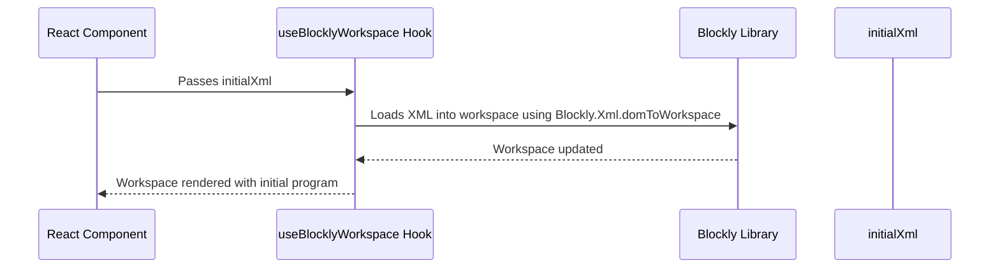

# Chapter 5: initialXml Prop

In the last chapter, [toolboxConfiguration](04_toolboxConfiguration.md), we learned how to define the blocks available in our Blockly workspace.  But what if we want to start with a pre-built program instead of a blank workspace?  That's where the `initialXml` prop comes in handy!

Imagine you're building a coding game where players can continue their progress from where they left off.  Instead of making them start from scratch every time, you can use `initialXml` to load their previous work.  This makes the experience much smoother and more engaging.

## Loading a Pre-existing Program

The `initialXml` prop allows you to load a Blockly program from XML data when the component mounts.  This XML data represents the blocks and their connections in your Blockly workspace.  It's like pre-filling a form with data – you start with a specific program instead of an empty workspace.

Let's say you have the following XML representing a simple addition:

```xml
<xml xmlns="https://developers.google.com/blockly/xml">
  <block type="math_number" x="10" y="10">
    <field name="NUM">5</field>
  </block>
  <block type="math_number" x="10" y="50">
    <field name="NUM">3</field>
  </block>
  <block type="math_arithmetic" x="10" y="90">
    <field name="OP">ADD</field>
    <value name="A">
      <shadow type="math_number">
        <field name="NUM">1</field>
      </shadow>
      <block type="math_number">
        <field name="NUM">5</field>
      </block>
    </value>
    <value name="B">
      <shadow type="math_number">
        <field name="NUM">1</field>
      </shadow>
      <block type="math_number">
        <field name="NUM">3</field>
      </block>
    </value>
  </block>
</xml>
```

This XML defines three blocks: two `math_number` blocks with values 5 and 3, and a `math_arithmetic` block that adds them together.

To load this program using `initialXml`, we'll modify our code from the previous chapter:

```jsx
import { useBlocklyWorkspace } from 'react-blockly';
import { useRef } from 'react';

const initialXml = `
<xml xmlns="https://developers.google.com/blockly/xml">
  <block type="math_number" x="10" y="10">
    <field name="NUM">5</field>
  </block>
  <block type="math_number" x="10" y="50">
    <field name="NUM">3</field>
  </block>
  <block type="math_arithmetic" x="10" y="90">
    <field name="OP">ADD</field>
    <value name="A">
      <shadow type="math_number">
        <field name="NUM">1</field>
      </shadow>
      <block type="math_number">
        <field name="NUM">5</field>
      </block>
    </value>
    <value name="B">
      <shadow type="math_number">
        <field name="NUM">1</field>
      </shadow>
      <block type="math_number">
        <field name="NUM">3</field>
      </block>
    </value>
  </block>
</xml>
`;

const toolbox = { /* ... toolbox configuration from previous chapter ... */ };

function MyBlocklyApp() {
  const blocklyRef = useRef(null);
  const { workspace } = useBlocklyWorkspace({ ref: blocklyRef, toolboxConfiguration: toolbox, initialXml });

  return (
    <div>
      <div ref={blocklyRef} />
    </div>
  );
}
```

This code will now render a Blockly workspace with the addition program already loaded.

## Internal Implementation (Simplified)

Here's a simplified view of how `initialXml` works:



The `useBlocklyWorkspace` hook receives the `initialXml` prop.  It then uses the Blockly library's `Blockly.Xml.domToWorkspace` function to parse the XML and load it into the workspace.  This happens before the workspace is rendered, so the user sees the pre-loaded program immediately.

## Conclusion

The `initialXml` prop simplifies the process of loading pre-existing Blockly programs, making it easier to create applications that allow users to save and resume their work.  In the next chapter, [onWorkspaceChange Callback](06_onWorkspaceChange_Callback.md), we'll explore how to handle changes made to the workspace.


---

Generated by [AI Codebase Knowledge Builder](https://github.com/The-Pocket/Tutorial-Codebase-Knowledge)