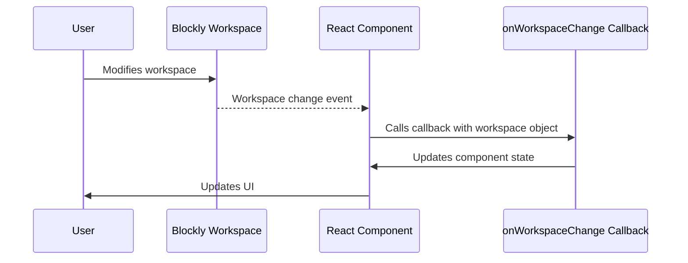

# Chapter 6: onWorkspaceChange Callback

In the previous chapter, [initialXml Prop](05_initialXml_Prop.md), we learned how to load a pre-existing Blockly program.  But what if we want our application to *react* to changes the user makes in the Blockly workspace? That's where the `onWorkspaceChange` callback comes in!

Let's say you're building a simple calculator app.  You want to display the result of the calculation the user creates using Blockly blocks.  The `onWorkspaceChange` callback will let you know whenever the user adds, removes, or modifies a block, allowing you to update the displayed result accordingly.

## Reacting to Workspace Changes

The `onWorkspaceChange` callback is a function that's automatically called whenever the user makes any change in the Blockly workspace.  It receives the Blockly workspace object as an argument. This object contains all the information about the current state of the workspace, allowing you to extract the code generated from the blocks.

Here's how you can use it:

```jsx
import { useBlocklyWorkspace } from 'react-blockly';
import { useRef, useState } from 'react';

function MyCalculator() {
  const blocklyRef = useRef(null);
  const [result, setResult] = useState('0'); // Initialize result
  const { workspace } = useBlocklyWorkspace({
    ref: blocklyRef,
    toolboxConfiguration: { /* ... your toolbox configuration ... */ },
    onWorkspaceChange: (ws) => { // Callback function
      const code = Blockly.JavaScript.workspaceToCode(ws); // Get generated code
      try {
        const calculatedResult = eval(code); // Evaluate the code (use with caution!)
        setResult(calculatedResult); // Update the state
      } catch (error) {
        setResult('Error'); // Handle errors
      }
    }
  });

  return (
    <div>
      <div ref={blocklyRef} />
      <p>Result: {result}</p>
    </div>
  );
}
```

This code defines a `MyCalculator` component.  It uses `useState` to track the `result` of the calculation. The `onWorkspaceChange` callback is passed to `useBlocklyWorkspace`.  Whenever the workspace changes, this callback is triggered. It gets the generated JavaScript code using `Blockly.JavaScript.workspaceToCode`, evaluates it using `eval` (**be cautious using `eval` in production; it's shown here for simplicity**), and updates the `result` state.  The updated `result` is then displayed.

Remember to replace `{ /* ... your toolbox configuration ... */ }` with the actual toolbox configuration from [Chapter 4](04_toolboxConfiguration.md).

## Internal Implementation (Simplified)

Here's how `onWorkspaceChange` works internally:



The user interacts with the Blockly workspace.  The Blockly library detects the change and triggers an event. The `react-blockly` library catches this event and calls the `onWorkspaceChange` callback, passing the workspace object. The callback then processes this object (e.g., extracts code, updates state), and the React component re-renders to reflect the changes.

The actual implementation involves event listeners within the `react-blockly` library that monitor changes in the Blockly workspace.  These listeners trigger the callback function whenever a change occurs.

## Conclusion

The `onWorkspaceChange` callback provides a powerful mechanism for building dynamic applications that respond to user interactions within the Blockly workspace.  It allows you to create interactive experiences where the application state is directly linked to the user's program. In the next chapter, [onXmlChange Callback](07_onXmlChange_Callback.md), we will explore another callback that provides the XML representation of the workspace changes.


---

Generated by [AI Codebase Knowledge Builder](https://github.com/The-Pocket/Tutorial-Codebase-Knowledge)