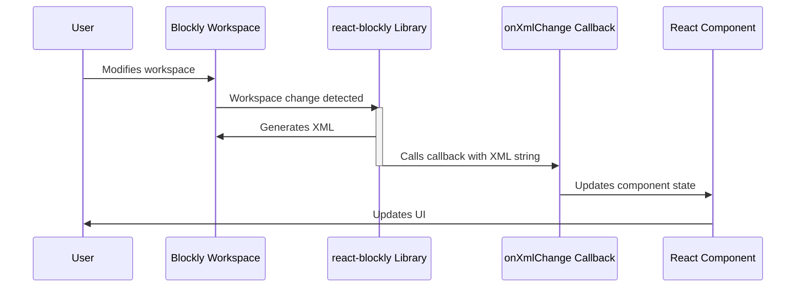

# Chapter 7: onXmlChange Callback

In the previous chapter, [onWorkspaceChange Callback](06_onWorkspaceChange_Callback.md), we learned how to respond to changes in the Blockly workspace using the `onWorkspaceChange` callback.  This callback is great for reacting to changes in real-time, but sometimes you need a more structured way to access the workspace's contents.  That's where the `onXmlChange` callback comes in!

Imagine you're building a Blockly-based application where users can save and load their programs.  You'll need a way to represent the user's program in a format that can be easily stored and retrieved.  The `onXmlChange` callback provides exactly that – it gives you the XML representation of the workspace, which is a structured way to represent the blocks and their connections.

## Getting a Snapshot of Your Program with `onXmlChange`

The `onXmlChange` callback is very similar to `onWorkspaceChange`, but instead of receiving the workspace object, it provides the workspace's XML representation as a string.  This XML string is a complete snapshot of the user's program, perfect for saving and loading.  It's like taking a photo of the workspace – you get a record of its state at a particular moment.

Let's modify our example from the previous chapter to use `onXmlChange` for saving the user's program:

```jsx
import { useBlocklyWorkspace } from 'react-blockly';
import { useRef, useState } from 'react';

function MyProgramSaver() {
  const blocklyRef = useRef(null);
  const [savedXml, setSavedXml] = useState(''); // Store the saved XML
  const { workspace } = useBlocklyWorkspace({
    ref: blocklyRef,
    toolboxConfiguration: { /* ... your toolbox configuration ... */ },
    onXmlChange: (xml) => { // Callback function
      setSavedXml(xml); // Update the saved XML state
    }
  });

  const saveProgram = () => {
    // Here you would typically save savedXml to your backend or local storage
    console.log("Saved XML:", savedXml);
  };

  return (
    <div>
      <div ref={blocklyRef} />
      <button onClick={saveProgram}>Save Program</button>
      <p>Saved XML: {savedXml}</p> </div>
  );
}
```

This code is almost identical to the previous chapter's example, but instead of processing the workspace directly, we use `onXmlChange` to update the `savedXml` state variable with the XML representation of the workspace.  The `saveProgram` function (which you'll need to implement to actually persist the data) shows how you can use this XML string.

This example shows how to capture the workspace's XML using `onXmlChange`. The XML is then stored in the component's state, ready to be saved or used elsewhere.


## Internal Implementation (Simplified)

Here's how `onXmlChange` works internally:



The user interacts with the Blockly workspace.  The `react-blockly` library detects the change and, after a short delay (debouncing), generates the XML representation of the workspace.  The `onXmlChange` callback is then called with this XML string.  The React component updates its state, and the UI is re-rendered.  The debouncing helps prevent performance issues from frequent updates.

## Conclusion

The `onXmlChange` callback provides a convenient way to obtain a structured representation of the Blockly workspace's contents.  This is particularly useful for saving and loading user programs.  In the next chapter, [Blockly Library Integration](08_Blockly_Library_Integration.md), we'll explore how to integrate custom Blockly blocks and libraries into your application.


---

Generated by [AI Codebase Knowledge Builder](https://github.com/The-Pocket/Tutorial-Codebase-Knowledge)