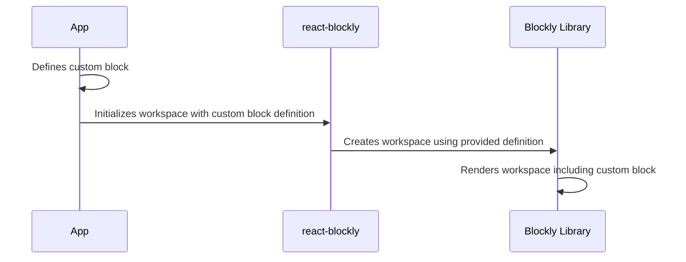

# Chapter 8: Blockly Library Integration

In the previous chapter, [onXmlChange Callback](07_onXmlChange_Callback.md), we learned how to get the XML representation of our Blockly workspace. Now, let's dive deeper into how `react-blockly` interacts with the Blockly library itself.  Understanding this will allow you to customize and extend the functionality of your visual programming interface.

Imagine you're building a more advanced application, perhaps a custom block for controlling a robot. You'll need to understand how to integrate your own custom blocks and potentially even modify Blockly's core behavior. This chapter will give you the foundational knowledge to do just that.

## Blockly's Core Components: Workspace, Toolbox, and Blocks

`react-blockly` relies heavily on the Blockly library.  To understand how to extend `react-blockly`, we need to understand Blockly's core components:

* **Workspace:** This is the main area where users arrange and connect blocks.  Think of it as the canvas where your visual program is built.

* **Toolbox:** This is the palette containing the available blocks.  Users drag blocks from the toolbox onto the workspace.  We've already seen how to configure this using `toolboxConfiguration` in [Chapter 4](04_toolboxConfiguration.md).

* **Blocks:** These are the individual building blocks of your visual program.  Each block represents a specific action or piece of data.  Blockly provides many built-in blocks, but you can also create your own custom blocks.

## Integrating Custom Blocks (A Simple Example)

Let's say we want to add a simple "Hello, World!" block to our Blockly workspace.  This requires creating a custom block definition using the Blockly library's API.  We won't go into the full details of creating complex custom blocks here, but we can show a basic example:

```javascript
// Define a simple "hello" block
Blockly.Blocks['hello'] = {
  init: function() {
    this.appendDummyInput()
        .appendField("Hello, World!");
    this.setPreviousStatement(true, null);
    this.setNextStatement(true, null);
    this.setColour(230); // Set the color of the block
  }
};

// Define the JavaScript generator for the "hello" block
Blockly.JavaScript['hello'] = function(block) {
  // Generate the JavaScript code for this block
  return 'alert("Hello, World!");\n';
};
```

This code defines a new block type named `hello`. The `init` function defines the block's appearance (in this case, just a label), and the `Blockly.JavaScript['hello']` function defines how this block translates into JavaScript code.

This code needs to be included *before* the Blockly workspace is initialized.  You can add it to your main application file or a separate file that is imported before the `useBlocklyWorkspace` hook is called.

This simple example shows how to add a basic block.  More complex blocks can have inputs, outputs, and more sophisticated logic.

## Internal Implementation (Simplified)

Here's a simplified view of how custom blocks are integrated:



The application defines the custom block.  `react-blockly` passes this definition to the Blockly library during workspace initialization.  The Blockly library then uses this definition to render the custom block in the workspace.

## Conclusion

This chapter provided a high-level overview of Blockly library integration.  Understanding Blockly's core components and how to define custom blocks is crucial for extending `react-blockly`'s functionality.  In the next chapter, [TypeScript](09_TypeScript.md), we'll explore how to use TypeScript with `react-blockly` for better type safety and code maintainability.


---

Generated by [AI Codebase Knowledge Builder](https://github.com/The-Pocket/Tutorial-Codebase-Knowledge)