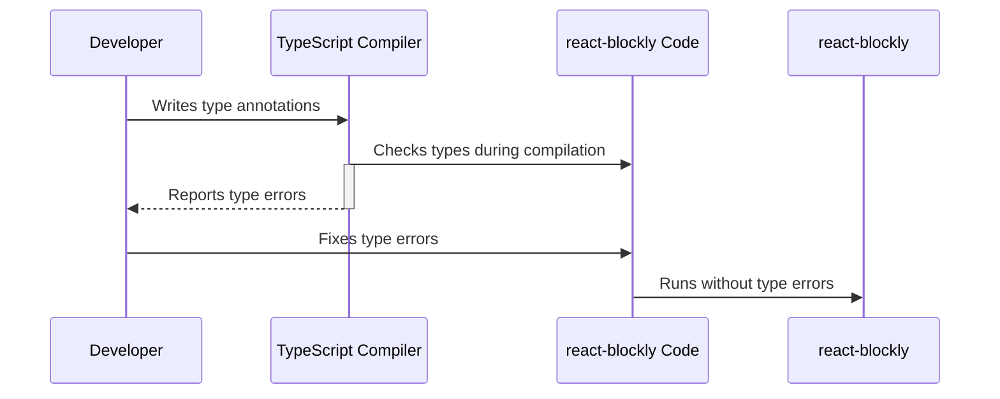

# Chapter 9: TypeScript

In the previous chapter, [Blockly Library Integration](08_Blockly_Library_Integration.md), we learned how to integrate custom blocks into our Blockly workspace. Now, let's enhance our code's robustness and readability using TypeScript.

TypeScript is a superset of JavaScript that adds static typing.  Imagine you're building with LEGOs.  JavaScript is like having a huge box of LEGOs with no instructions – you can build anything, but it's easy to make mistakes. TypeScript is like having those same LEGOs, but with instructions and pre-sorted bricks.  You still have the flexibility of JavaScript, but with added safety and organization. This helps catch errors early, before they cause problems in your application.

Let's consider a simple example:  We want to ensure that a function that receives a Blockly workspace always receives a valid workspace object and not `null` or `undefined`.  Without TypeScript, we'd have to rely on runtime checks, which can lead to unexpected errors. With TypeScript, we can enforce this at compile time.

## Adding TypeScript to Your Project

First, make sure you have TypeScript installed (`npm install --save-dev typescript`).  Then, create a `tsconfig.json` file in your project's root directory.  This file configures the TypeScript compiler.  A basic `tsconfig.json` might look like this (a more complete version is shown in the code snippets):

```json
{
  "compilerOptions": {
    "target": "es5", // Compile to ES5 for broader compatibility
    "module": "esnext", // Use ES modules
    "jsx": "react-jsx" // Enable JSX support
  }
}
```

This tells TypeScript to compile your code to ES5 (compatible with older browsers), use ES modules, and enable JSX syntax.  You'll also need to rename your `.js` files to `.tsx` (for TypeScript React components).

## Type Safety in Action

Let's rewrite our `MyCalculator` component from [Chapter 6](06_onWorkspaceChange_Callback.md) using TypeScript:

```typescript jsx
import { useBlocklyWorkspace } from 'react-blockly';
import { useRef, useState } from 'react';

function MyCalculator() {
  const blocklyRef = useRef<HTMLDivElement>(null); // Specify the type of the ref
  const [result, setResult] = useState<string>('0'); // Specify the type of the state
  const { workspace } = useBlocklyWorkspace({
    ref: blocklyRef,
    toolboxConfiguration: { /* ... your toolbox configuration ... */ },
    onWorkspaceChange: (ws: Blockly.Workspace) => { // Specify the type of the workspace
      // ... (rest of the code remains the same) ...
    }
  });

  return (
    <div>
      <div ref={blocklyRef} />
      <p>Result: {result}</p>
    </div>
  );
}
```

Notice how we've added type annotations: `<HTMLDivElement>` for `blocklyRef`, `<string>` for `result`, and `: Blockly.Workspace` for the `workspace` parameter in `onWorkspaceChange`.  This tells TypeScript the expected types for these variables, allowing it to catch type errors during compilation.

## Internal Implementation (Simplified)

Here's how TypeScript improves the internal workings of `react-blockly`:



The developer adds type annotations to the code. The TypeScript compiler checks these types during compilation. If there are type errors, the compiler reports them to the developer. The developer fixes the errors, and the code runs without type errors.

The TypeScript compiler ensures type safety throughout the `react-blockly` codebase, preventing many potential runtime errors.  This is reflected in the `tsconfig.json` file and the type annotations throughout the source code.

## Conclusion

This chapter showed how to integrate TypeScript into your `react-blockly` project.  Adding type annotations improves code maintainability and helps catch errors early.  In the next chapter, [Webpack](10_Webpack.md), we'll explore how to use Webpack to bundle your application for production.


---

Generated by [AI Codebase Knowledge Builder](https://github.com/The-Pocket/Tutorial-Codebase-Knowledge)