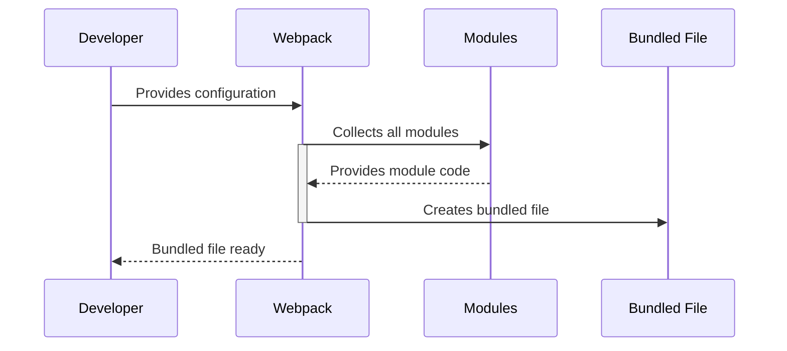

# Chapter 10: Webpack

In the previous chapter, [TypeScript](09_TypeScript.md), we improved our code's quality using TypeScript. Now, let's focus on preparing our application for deployment.  This involves bundling all our JavaScript, CSS, and other assets into a single, optimized file that's ready to be served on a web server. This is where Webpack comes in.

Imagine you're baking a cake. You have all the ingredients (your JavaScript code, CSS styles, images, etc.) separately.  Webpack is like the oven and the baker – it takes all these separate ingredients and combines them into a delicious, ready-to-serve cake (your website).

## What is Webpack?

Webpack is a powerful module bundler.  It takes all the different parts of your project (JavaScript, CSS, images, etc.) and combines them into one or more optimized files that a web browser can easily load and run.  This makes your website load faster and makes it easier to manage your project's files.

## Webpack in `react-blockly`

`react-blockly` uses Webpack to bundle the project.  Without Webpack, you'd have many separate JavaScript files, making your website slow to load.  Webpack solves this by combining all the necessary files into a single, optimized file.

Let's look at a simplified example of a `webpack.config.js` file (the actual configuration is more complex, but this captures the essence):

```javascript
// webpack.config.js (simplified)
module.exports = {
  // ... other configurations ...
  entry: "./src/index.tsx", // Entry point of your application
  output: {
    path: path.resolve(__dirname, "dist"), // Output directory
    filename: "bundle.js" // Output filename
  }
  // ... other configurations ...
};
```

This simplified configuration tells Webpack to start bundling from `./src/index.tsx` and to place the resulting bundled file (`bundle.js`) in the `dist` directory.

This configuration is typically handled by a build tool like `webpack-cli`.  You would run a command like `npx webpack` (or a similar command depending on your setup) to trigger the bundling process.

## Internal Implementation (Simplified)

Here's how Webpack works at a high level:



The developer provides a configuration file (like `webpack.config.js`). Webpack reads this configuration and collects all the necessary modules (JavaScript files, CSS files, etc.).  It then combines these modules into a single bundled file, ready for deployment.

The actual Webpack implementation involves complex dependency resolution, code optimization, and asset management.  This is handled internally by Webpack, abstracting away the complexities from the developer.

## Conclusion

Webpack is a crucial tool for building and deploying web applications.  It simplifies the process of managing and optimizing your project's assets, resulting in faster loading times and improved performance.  This chapter provided a beginner-friendly introduction to Webpack and its role in `react-blockly`.  While we haven't covered all the intricacies of Webpack configuration, understanding its basic function is essential for deploying your `react-blockly` applications.


---

Generated by [AI Codebase Knowledge Builder](https://github.com/The-Pocket/Tutorial-Codebase-Knowledge)