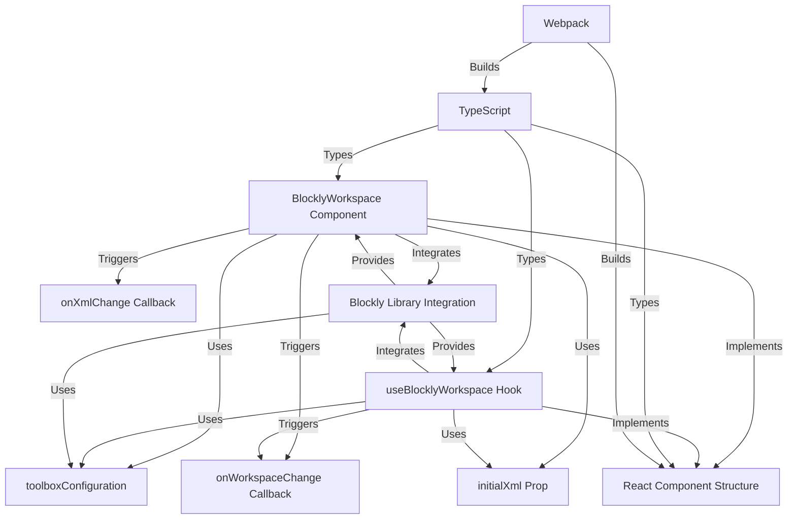

# Tutorial: react-blockly

`react-blockly` is a *React* library that lets you easily add **Blockly**, a visual programming editor, to your web applications.  It provides both a *component* and a *hook* for flexible integration, allowing users to create and manipulate programs visually.  The library handles the communication between React and Blockly, making it simple to build interactive visual programming interfaces.

**Source Repository:** [https://github.com/nbudin/react-blockly/tree/main](https://github.com/nbudin/react-blockly/tree/main)

## Core Concepts Diagram

## Chapters

1. [React Component Structure](01_React_Component_Structure.md)
2. [BlocklyWorkspace Component](02_BlocklyWorkspace_Component.md)
3. [useBlocklyWorkspace Hook](03_useBlocklyWorkspace_Hook.md)
4. [toolboxConfiguration](04_toolboxConfiguration.md)
5. [initialXml Prop](05_initialXml_Prop.md)
6. [onWorkspaceChange Callback](06_onWorkspaceChange_Callback.md)
7. [onXmlChange Callback](07_onXmlChange_Callback.md)
8. [Blockly Library Integration](08_Blockly_Library_Integration.md)
9. [TypeScript](09_TypeScript.md)
10. [Webpack](10_Webpack.md)

---

Generated by [AI Codebase Knowledge Builder](https://github.com/The-Pocket/Tutorial-Codebase-Knowledge)